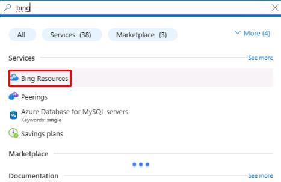
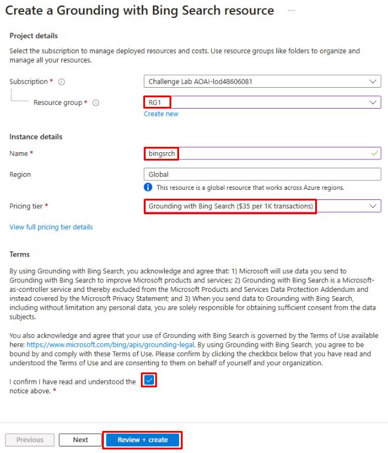
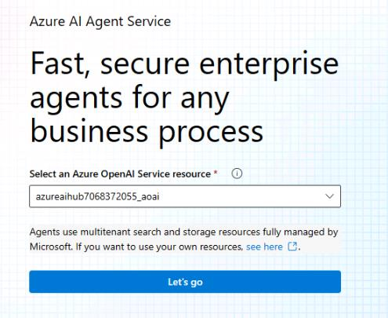
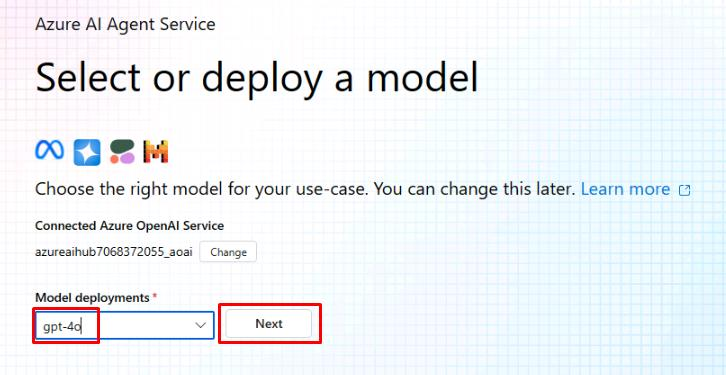
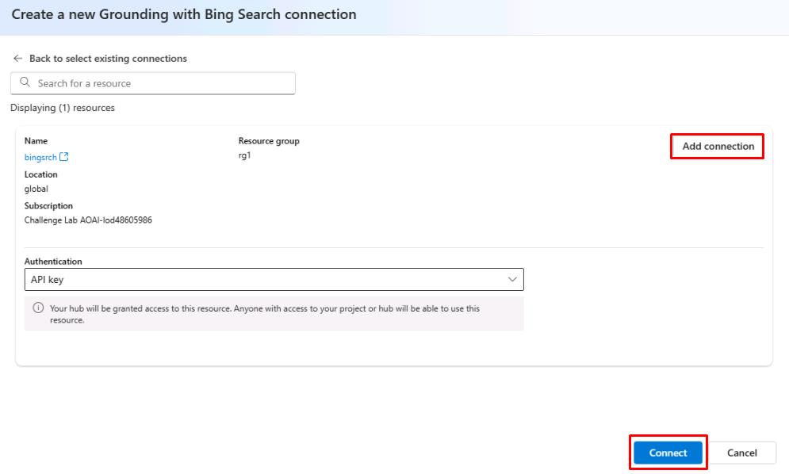
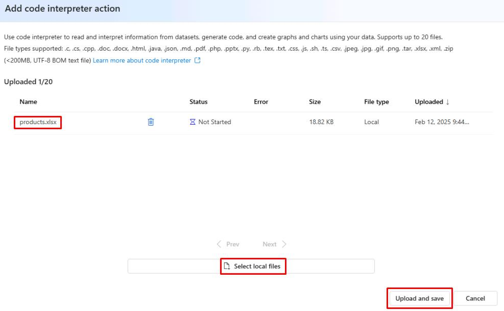
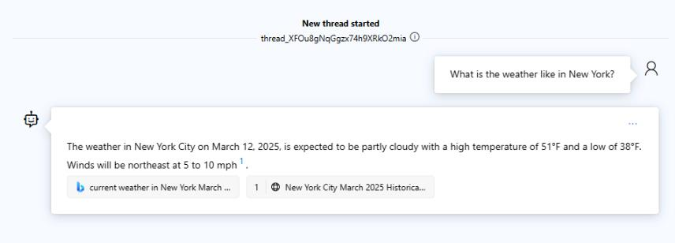
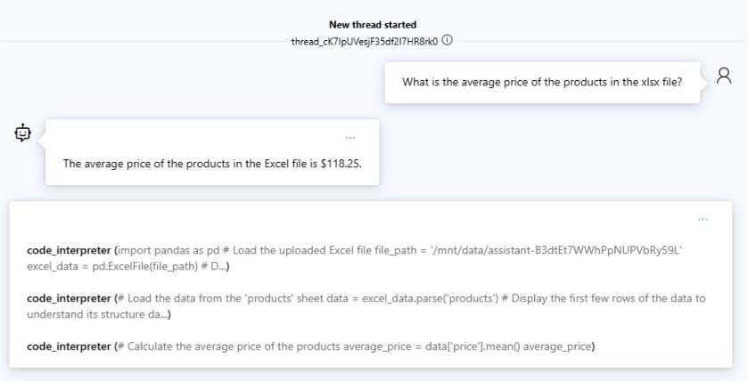

# Lab 2: Create AI Agent in AI Foundry UI

## Description
In this Lab, you’ll learn how to create a Simple Agent in AI Foundry that can retrieve answers from an excel file and also query Bing Search for latest weather.

## Key Tasks

### 01: Set up Grounding with Bing Search in Azure Portal
1. Log into Azure portal, In the search bar at the top, search for **bing** and then select **Bing Resources**.



3. From the **Bing Resources** page, select **+ Add**, then select **+ Grounding with Bing Search**.

4. On the **Create a Grounding with Bing Search resource** page, select your resource group and pricing tier. Give it a name of **bingsrch** and select **Review + Create**, then select **Create**.

9. Switch to AI Foundry and select **Agents** from the left menu.

10. Under **Select an Azure OpenAI Service resource**, select your hub and select **Let’s go**.

11. Under **Select or deploy a model**, select **gpt-4o** then select **Next**.

12. Select the agent to open the **Setup** pane.
13. In the **Instructions** field of the **Setup** pane, copy and paste the following:

```
Understand User Query:
Analyze the user's query to identify if it requires real-time information (e.g., weather, date, news).

Use Bing Search Tool for Real-Time Data:
If the query involves up-to-date information, use the Bing Search tool to retrieve relevant data.

Craft a Clear, Concise Response:
Extract the relevant information (e.g., temperature, news) and provide the answer in a simple and direct way.

Ask for Clarification if Needed:
If the query is vague or missing details (e.g., location for weather), ask the user for more information.
```

14. Under **Knowledge** in the **Setup** pane, select **+ Add**, then select **Grounding with Bing Search**.
15. Select the **+ Create connection** connection, then select **Add connection** next to the **bingsrch** resource.

16. Under **Actions** in the **Setup** pane, select **+ Add**, then select **Code interpreter**.
17. On the **Add code interpreter action** page, select **Select local files** and then select the **products.xlsx** file created earlier.
18. Select **Upload and Save**.

19. From the upper right of the **Setup** pane, select **Try in playground**.
20. In the **Agents playground** chat, enter **What is the weather like in New York?**

21. In the chat, enter **What is the average price of the products in the xlsx file?**

